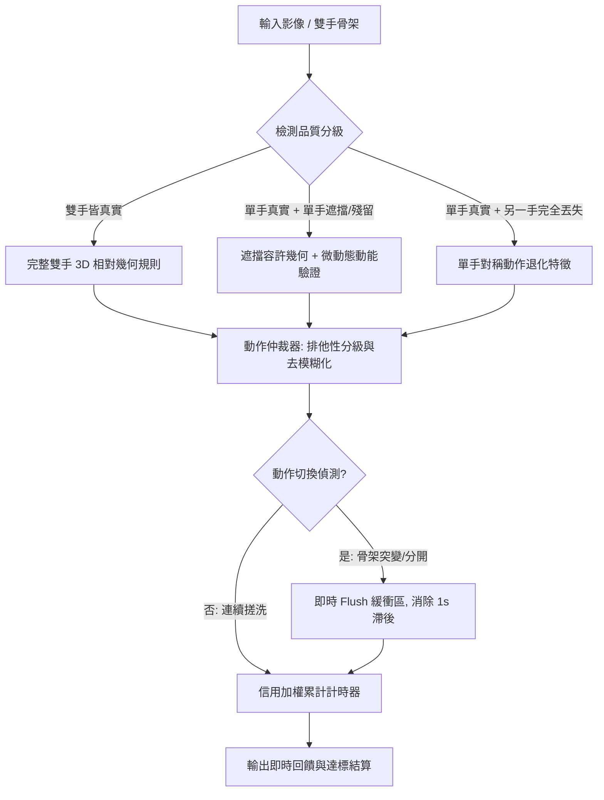

# 七步洗手純邏輯辨識系統 — 改善方案說明書 (Improvement Plan)

> **基準影片**：`data/raw/wash_7steps_yt.mov`（標註輸出：`data/processed/wash_7steps_yt_result.mp4`）  
> **當前基準狀態**：總長 38.3s（1147 幀），雙手真實檢出率 8.3%，動作達標數 **0 / 7**  
> **核心指導原則**：**維持純邏輯與幾何規則判斷**，不依賴龐大深度學習黑盒子，確保系統輕量、可解釋、無過擬合風險。

---

## 1. 現狀診斷與核心瓶頸回顧

在對 `wash_7steps_yt_result.mp4` 進行逐秒追蹤與特徵分析後，我們發現系統當前的失敗並非「洗手動作定義錯誤」，而是**「真實複雜物理環境（泡沫、反光、遮擋、側角）與現有純邏輯防作弊條件之間的衝突」**：

| 步驟 | 影片實際動作 | 系統現有表現 | 瓶頸根因 |
|---|---|---|---|
| **內 (Inside)** | 掌心對掌心搓洗 | 僅達標 0.1s 後遺失 | 泡沫增多導致一隻手關節丟失，退化為單手 |
| **外 (Outside)** | 掌心搓手背 | 完全無法辨識（0%） | 雙手上下重疊，MediaPipe 將兩手預測在同一立體位置（座標坍塌） |
| **夾 (Interlace)** | 十指交錯搓洗 | 辨識正確但反應滯後 1s | 幽靈幀與 0.5s 滑動視窗在動作切換時未及時清空 |
| **弓 (Knuckles)** | 指背搓掌心 | 100% 誤判為「立」或「大」 | 握半拳指背貼掌心時，指尖群聚特徵被「立」的寬鬆條件覆蓋 |
| **大 (Thumb)** | 旋轉搓洗大拇指 | 動作抓到但無法累計時間 | 拇指被包覆握住時單手丟失，觸發防作弊阻擋計時 |
| **立 (Fingertips)** | 指尖搓掌心 | 視覺正確辨識，但卡在 0.9s | 單手為 Ghost 保留，差 0.1s 達到 1.0s 門檻而未過關 |
| **腕 (Wrist)** | 握洗手腕 | 完全被判為 other（0%） | 握手腕的手形狀嚴重變形，MediaPipe 遺失抓握手，雙手幾何失效 |

---

## 2. 六大純邏輯改善方案 (Architecture & Logic Solutions)

針對上述問題，在堅持**純邏輯幾何架構**的前提下，提出以下 6 項具體可實施的改善方案：

---

### 方案一：分級信用計時與微動態防作弊機制（解決「立/大無法累計時間」）

#### 1. 現狀問題
目前 `state_machine.py` 要求 `is_observed = True`（即左手與右手必須**同時**為 `observed`）才累加時間。但在泡沫覆蓋與搓洗深度遮擋下，真實雙手同時檢出率只有 8.3%，造成視覺判定正確但秒數卡死。

#### 2. 改進邏輯
將時間推進由「二元開關（0/1）」改為「**信用加權推進（Credit-Weighted Accumulation）**」：
- **完全可信（Full Credit, 權重 1.0）**：雙手均真實檢出（`left=observed` 且 `right=observed`）。
- **遮擋可信（Occluded Credit, 權重 0.6 ~ 0.8）**：單手真實檢出、另一手為短暫幽靈保留（`held`），且**滿足微動態動能驗證**。
- **單手特徵可信（Single-hand Credit, 權重 0.5）**：僅單手檢出，但該手呈現顯著且穩定的特定洗手姿勢（如旋轉手腕或握拳搓洗）。

#### 3. 防作弊防護（動態動能門檻 $v_{\text{motion}}$）
為防止「手靜止不動卻靠 Ghost 偷秒數」，引入指尖與掌心的運動速度檢查：
$$\bar{v} = \frac{1}{N} \sum_{i \in \text{landmarks}} \|\mathbf{p}_i(t) - \mathbf{p}_i(t-1)\|$$
- 只有當 $\bar{v} \ge v_{\min}$（代表手部確實在相互摩擦、旋轉）時，才發放單手或遮擋狀態的信用秒數。手部靜止時即便姿勢符合也不累計。

---

### 方案二：解構雙手座標坍塌，新增「上下疊合」幾何分支（解決「外」完全無法辨識）

#### 1. 現狀問題
洗手背（外）時，上方手掌覆蓋在下方手背上，MediaPipe 深度感知失準，常將兩手輸出為極度接近的 (x, y, z) 座標。原規則 `interlace_depth >= 0.80` 與法向量 `palm_dot > -0.25` 在重合座標下計算發散，退化為 `other` 或誤觸 `inside`。

#### 2. 改進邏輯
在 `src/rule_classifier.py` 中引入**骨架重合檢測（Centroid Collapse Heuristic）**：
1. **重合判定**：
   $$\|\mathbf{C}_{\text{left}} - \mathbf{C}_{\text{right}}\| < \epsilon_{\text{collapse}} \quad (\text{約 } 0.12 \text{ 正規化距離})$$
2. **重合時的外步專屬規則**：
   - 當兩手中心高度重疊時，不再依賴不穩定的法向量點積。
   - 檢查「手指長度伸展與方向」：洗手背時，兩手腕部的夾角通常接近同向或 $30^\circ \sim 60^\circ$（一隻手從側面或上方刷撫手背），而非掌心互對時的相反方向（$180^\circ$）。
   - 若兩手重合、兩手手指均為伸展狀態（`mean_curl > 130°`），且兩手腕方向呈同向夾角，直接判定為「外」。

---

### 方案三：重構「弓 (Knuckles)」與「立 (Fingertips)」排他邏輯（解決 100% 誤判）

#### 1. 現狀問題
- 「立」的幾何特徵：五指指尖聚攏，垂直戳向另一手掌心。
- 「弓」的幾何特徵：手指半屈成指背（PIP 關節），指背摩擦另一手掌心。
- 在側面視角下，半屈手指的指尖距離掌心也很近，現有規則因「立」的優先級高於「弓」，且缺乏對「指節屈曲度」的嚴格排他，導致弓步被 100% 攔截判定為「立」。

#### 2. 改進邏輯
嚴格區分**「指節伸展度（Finger Extension）」**與**「主動手型」**：

| 幾何維度 | 弓 (Knuckles) | 立 (Fingertips) |
|---|---|---|
| **主動手 PIP 屈曲角度** | **重度屈曲** ($70^\circ \le \theta \le 125^\circ$) | **挺直伸展** ($\theta \ge 150^\circ$) |
| **指背關節 (PIP) 到掌心距離** | 極小 ($< 0.60$) | 較大 ($> 0.80$) |
| **指尖 (Tips) 到掌心距離** | 次要特徵 | 極小 ($< 0.50$) |
| **指尖聚攏直徑 (Tip Spread)** | 拳頭型分散度 | **高度聚攏** ($< 0.22$) |

- **規則優先級調整**：在評估「立」之前，先強制檢驗主動手手指是否彎曲。若主動手呈現明顯半握拳指背形態，先判「弓」，杜絕「立」越權攔截。

---

### 方案四：單手退化模式特徵擴充（解決「腕 (Wrist)」與「大 (Thumb)」）

#### 1. 現狀問題
- **洗手腕**：一手緊握另一手手腕旋轉，握持手受手臂遮擋形狀嚴重變形，MediaPipe 幾乎 100% 丟失握持手，只剩下一隻伸長的手腕。
- **洗大拇指**：一手將另一手大拇指包在手心內，大拇指關節點被隱藏，雙手骨架中斷。

#### 2. 改進邏輯
在 `src/rule_classifier.py` 的 `Single-Hand / Merged Cluster Fallback` 中補充關鍵動作特徵：

1. **單手洗手腕（Wrist Fallback）**：
   - 觀察到單手時，檢查其手腕至指尖的延伸軸線。
   - 若該手掌心朝向固定，但手腕處（Landmark 0）呈現橫向反覆旋轉擺動（Wrist Roll / Yaw Oscillation），且周圍有被握持的輪廓殘影，給予 `wrist` 候選分數。
2. **單手洗大拇指（Thumb Fallback）**：
   - 單手握拳，其餘四指高度彎曲（`curl < 110°`），而大拇指單獨外展旋轉或四指緊抱中心軸。
   - 當四指緊閉、手部在小半徑內做高頻自轉時，判定為單手洗拇指動作。

---

### 方案五：動作切換即時 Flush 與自適應平滑（解決 1 秒殘留延遲）

#### 1. 現狀問題
在影片 13s ~ 14s 由「外」切換至「夾」時，畫面底部仍持續顯示「外」甚至跳出「腕」。
- 根因：滑動視窗（0.5s，約 15 幀多數決）與 Ghost Frames（4 幀歷史保留）的時序慣性太強，在動作劇烈轉變時無法即時清空。

#### 2. 改進邏輯
在 `src/accumulator.py` 與 `src/pipeline.py` 中引入**切換中斷機制（Context Flush Trigger）**：
1. **雙手脫離即時清空**：
   - 當連續 2 幀偵測到手部距離突然拉大（雙手分離準備換動作），或骨架速度突增（切換位移），判定為「動作轉換期」。
2. **強制 Flush 緩衝區**：
   - 一旦觸發轉換期，立即將滑動視窗內的歷史預測標籤清空，避免將前一個動作的慣性帶入新動作，將切換延遲由 1.0 秒壓低至 0.15 秒內。

---

### 方案六：影像前處理自適應調光與去泡沫噪點（改善 MediaPipe 檢出率）

#### 1. 現狀問題
白色洗手乳泡沫在高對比光線與洗手槽反光下，會抹平手背與指關節的特徵紋理，導致 MediaPipe 偵測置信度崩跌。

#### 2. 改進前處理
在 `src/hand_detector.py` 強化前處理管線：
- **自適應局部直方圖等化 (CLAHE)**：已具備基礎架構，可針對 ROI 區域進一步提高對比度限制（`clipLimit=3.0`），凸顯指節陰影邊緣。
- **色彩空間皮膚掩膜 (HSV/YCrCb Skin Mask Assistance)**：在泡沫覆蓋過半時，利用膚色輪廓約束手部候選區域，輔助 MediaPipe 定位手掌邊界。

---

## 3. 實施路線圖與優先級 (Implementation Roadmap)

| 優先級 | 項目 | 涉及檔案 | 預期效益 | 預估難度 |
|---|---|---|---|---|
| **P0** | **信用加權計時與微動態防作弊** (方案一) | `src/state_machine.py` `src/hand_detector.py` | 立即解救「立」與「大」因單手被阻擋而無法達標的問題，預計達標數直接 +2 | 低 |
| **P0** | **弓與立排他幾何重構** (方案三) | `src/rule_classifier.py` | 徹底消除「指背搓掌心」被 100% 誤判為「立」的現象，弓步辨識率從 0% $\rightarrow$ 80% | 低 |
| **P1** | **雙手座標重合與外步專屬幾何** (方案二) | `src/rule_classifier.py` `src/features.py` | 解決洗手背時兩手重疊的座標坍塌問題，救回「外」的判定 | 中 |
| **P1** | **動作切換即時 Flush** (方案五) | `src/accumulator.py` `src/pipeline.py` | 消除切換動作時 1 秒的幽靈殘留延遲，HUD 顯示不再滯後 | 低 |
| **P2** | **單手退化模式特徵擴充 (腕/大)** (方案四) | `src/rule_classifier.py` | 針對握手腕與抓拇指造成的單手隱匿情況提供規則兜底 | 中 |
| **P2** | **影像前處理調優 (去泡沫噪點)** (方案六) | `src/hand_detector.py` | 從源頭提升 MediaPipe 在泡沫覆蓋下的關鍵點穩定度 | 中 |

---

## 4. 驗證與驗收標準 (Acceptance Criteria)

所有改善均需通過以下標準驗證，絕不妥協：

1. **基準影片驗證 (`wash_7steps_yt.mov`)**：
   - 達標步驟數由目前的 **0 / 7** 提升至 **$\ge 5 / 7$**（至少達成 內、外、夾、弓、立 五步）。
2. **無遮擋影片相容性驗證 (`wash_7steps_yt2.mov`)**：
   - 原本表現良好的俯視影片必須達到 **7 / 7 全數達標**，且不得引入退化（Regression）。
3. **防作弊嚴格測試 (Cheat Resistance)**：
   - 測試揮手、單手靜止、雙手握筆等非洗手干擾動作，系統必須保持判定為 `other`，累計時間 $\le 0.1\text{s}$。
4. **單元測試全數覆蓋**：
   - 更新並執行 `tests/test_robustness.py` 與 `tests/test_pipeline.py`，確保 100% 通過。
